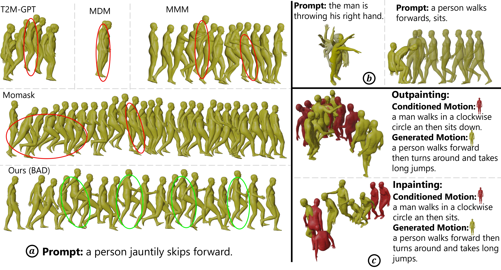

# BAD: Bidirectional Auto-regressive Diffusion for Text-to-Motion Generation
### [[Paper]](https://www.arxiv.org/abs/2409.10847)

If you find our code or paper helpful, please consider starring our repository and citing us.
```
@article{hosseyni2024bad,
  title={BAD: Bidirectional Auto-regressive Diffusion for Text-to-Motion Generation},
  author={Hosseyni, S Rohollah and Rahmani, Ali Ahmad and Seyedmohammadi, S Jamal and Seyedin, Sanaz and Mohammadi, Arash},
  journal={arXiv preprint arXiv:2409.10847},
  year={2024}
}
```

## News

📢 **2024-09-24** --- Initialized the webpage and git project.  


## Get You Ready

<details>
  
### 1. Conda Environment
```
conda env create -f environment.yml
conda activate BAD
```

### 2. Models and Dependencies

#### Download Pre-trained Models
```
bash prepare/download_models.sh
```

#### Download Evaluation Models and Gloves
For evaluation only.
```
bash prepare/download_extractor.sh
bash prepare/download_glove.sh
```

#### Troubleshooting
To address the download error related to gdown: "Cannot retrieve the public link of the file. You may need to change the permission to 'Anyone with the link', or have had many accesses". A potential solution is to run `pip install --upgrade --no-cache-dir gdown`, as suggested on https://github.com/wkentaro/gdown/issues/43. This should help resolve the issue.

#### (Optional) Download Manually
Visit [[Google Drive]](https://drive.google.com/drive/folders/1sHajltuE2xgHh91H9pFpMAYAkHaX9o57?usp=drive_link) to download the models and evaluators mannually.

### 3. Get Data
**HumanML3D** -
We are using two 3D human motion-language dataset: HumanML3D and KIT-ML. For both datasets, you could find the details as well as download link [here](https://github.com/EricGuo5513/HumanML3D.git).

```
./dataset/HumanML3D/
├── new_joint_vecs/
├── texts/
├── Mean.npy # same as in [HumanML3D](https://github.com/EricGuo5513/HumanML3D) 
├── Std.npy # same as in [HumanML3D](https://github.com/EricGuo5513/HumanML3D) 
├── train.txt
├── val.txt
├── test.txt
├── train_val.txt
└── all.txt
```

**KIT-ML** - For KIT-ML dataset, you can download and extract it using the following files:

```
bash dataset/prepare/download_kit.sh
bash dataset/prepare/extract_kit.sh
```
If you face any issues, you can refer to [this link](https://github.com/EricGuo5513/HumanML3D.git).


</details>

## Training

<details>

### Stage 1: VQ-VAE
```
python train_vq.py --exp_name 'trian_vq' \
                   --dataname t2m \
                   --total_batch_size 256
```
- **`--exp_name`**: The name of your experiment.
- **`--dataname`**: Dataset name; use `t2m` for HumanML3D and `kit` for KIT-ML dataset.
### Stage 2: Transformer
```
python train_t2m_trans.py --exp_name 'train_tr' \
                          --dataname t2m \
                          --time_cond \
                          --z_0_attend_to_all \
                          --unmasked_tokens_not_attend_to_mask_tokens \
                          --total_batch_size 256 \
                          --vq_pretrained_path ./output/vq/vq_last.pth
```
the KIT-ML dataset.
- **`--z_0_attend_to_all`**: Specifies the causality condition for mask tokens, where each mask token attends to the last `T-p+1` mask tokens. If `z_0_attend_to_all` is not activated, each mask token attends to the first `p` mask tokens.
- **`--time_cond`**: Uses time as one of the conditions for training the transformer.
- **`--unmasked_tokens_not_attend_to_mask_tokens`**: Prohibits mask tokens from attending to other mask tokens.
- **`--vq_pretrained_path`**: The path to your pretrained VQ-VAE.

</details>


## Evaluation

<details>

For sampling using Order-Agnostic Autoregressive Sampling (OAAS), `rand_pos` should be set to `False`. `rand_pos=False` means that the token with the highest probability is always sampled, and no `top_p`, `top_k`, or `temperature` is applied. If `rand_pos=True`, the metrics significantly worsen, whereas in Confidence-Based Sampling (CBS), the metrics significantly improve. We do not know why OAAS performance worsens with random sampling during generation. Maybe this is a bug; we are not sure! We would be extremely grateful if anyone could help fix this issue.
```
python GPT_eval_multi.py --exp_name "eval" \
                         --sampling_type OAAS \
                         --z_0_attend_to_all \
                         --time_cond  \
                         --unmasked_tokens_not_attend_to_mask_tokens \
                         --num_repeat_inner 1 \
                         --resume_pth ./output/vq/vq_last.pth \
                         --resume_trans ./output/t2m/trans_best_fid.pth
```
- **`--sampling_type`**: Type of sampling.
- **`--num_repeat_inner`**: If you want to calculate MModality, it should be above 10, like 20. For other metrics, 1 is enough.
- **`--resume_pth`**: The path to your pretrained VQ-VAE.
- **`--resume_trans`**: The path to your pretrained transformer.


For sampling using Confidence-Based Sampling (CBS), `rand_pos=True` significantly improves FID compared to CBS with `rand_pos=False`.

```
python GPT_eval_multi.py --exp_name "eval" \
                         --z_0_attend_to_all \
                         --time_cond  \
                         --sampling_type CBS \
                         --rand_pos \
                         --unmasked_tokens_not_attend_to_mask_tokens \
                         --num_repeat_inner 1 \
                         --resume_pth ./output/vq/vq_last.pth \
                         --resume_trans ./output/t2m/trans_best_fid.pth
```

For evaluation of four temporal editing tasks (inpainting, outpainting, prefix prediction, suffix prediction), you should use `eval_edit.py`. We used OAAS to report our results on temporal editing tasks in Table 3 of the paper.
```
python eval_edit.py --exp_name "eval" \
                    --edit_task inbetween \
                    --z_0_attend_to_all \
                    --time_cond  \
                    --sampling_type OAAS \
                    --unmasked_tokens_not_attend_to_mask_tokens \
                    --num_repeat_inner 1 \
                    --resume_pth ./output/vq/vq_last.pth \
                    --resume_trans ./output/t2m/trans_best_fid.pth
```
- **`--edit_task`**: Four edit tasks are available: `inbetween`, `outpainting`, `prefix`, and `suffix`.

</details>


## Generation

<details>

For generating a motion sequence run the following
```
python generate.py --caption 'a person jauntily skips forward.' \
                   --length 196 \
                   --z_0_attend_to_all \
                   --time_cond  \
                   --sampling_type OAAS \
                   --unmasked_tokens_not_attend_to_mask_tokens \
                   --resume_pth ./output/vq/vq_last.pth   \
                   --resume_trans ./output/t2m/trans_best_fid.pth
```
- **`--length`**: The length of the motion sequence. If not provided, a length estimator will be used to predict the length of the motion sequence based on the caption.
- **`--caption`**: Text prompt used for generating the motion sequence.


For temporal editing, run the following. 
```
python generate.py --generate_inbetween \
                   --caption 'a person jauntily skips forward.' \
                   --caption_inbetween 'a man walks in a clockwise circle an then sits.' \
                   --length 196 \
                   --edit_task inbetween \
                   --z_0_attend_to_all \
                   --time_cond \
                   --sampling_type OAAS \
                   --unmasked_tokens_not_attend_to_mask_tokens \
                   --resume_pth ./output/vq/vq_last.pth   \
                   --resume_trans ./output/t2m/trans_best_fid.pth
```
- **`--caption_inbetween`**: Text prompt used for generating the `inbetween`/`outpainting`/`prefix`/`suffix` motion sequence.
- **`--edit_task`**: Four edit tasks are available: `inbetween`, `outpainting`, `prefix`, and `suffix`.

</details>


## Visualization

<details>

The above commands will save `.bvh` and `.mp4` files in `./output/visualization/` directory. The `.bvh` file can be rendered in Blender. Please refer to [this link](https://github.com/EricGuo5513/momask-codes?tab=readme-ov-file#dancers-visualization) for more information.

To render the motion sequence in SMPL, you need to pass the `.npy` file generated by `generate.py` to `visualization/render_mesh.py`. The following command will create `.obj` files that can be easily imported into Blender.

```
python visualization/render_mesh.py \
  --input_path output/visualization/animation/a_person_jauntily_skips_forwar_196/sample103_repeat0_len196.mp4 \
  --npy_path output/visualization/joints/a_person_jauntily_skips_forwar_196/sample103_repeat0_len196.npy 
```
- **`--input_path`**: Path to the `.mp4` file, created by `generate.py`.
- **`--npy_path`**: Path to the `.npy` file, created by `generate.py`

</details>

## Acknowledgement

We would like to express our sincere gratitude to [MMM](https://github.com/exitudio/MMM.git), [Momask](https://github.com/EricGuo5513/momask-codes.git), [MDM](https://github.com/GuyTevet/motion-diffusion-model.git), and [T2M-GPT](https://github.com/Mael-zys/T2M-GPT.git) for their outstanding open-source contributions.
